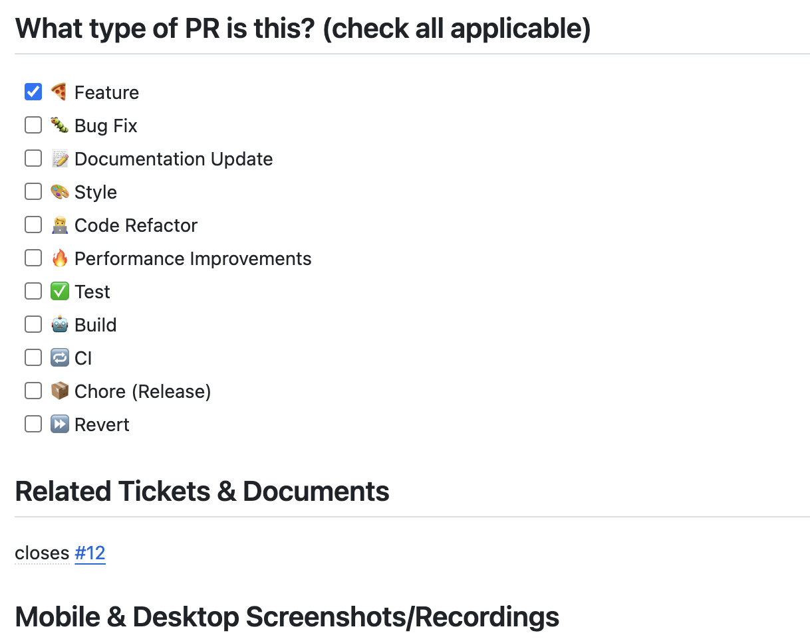
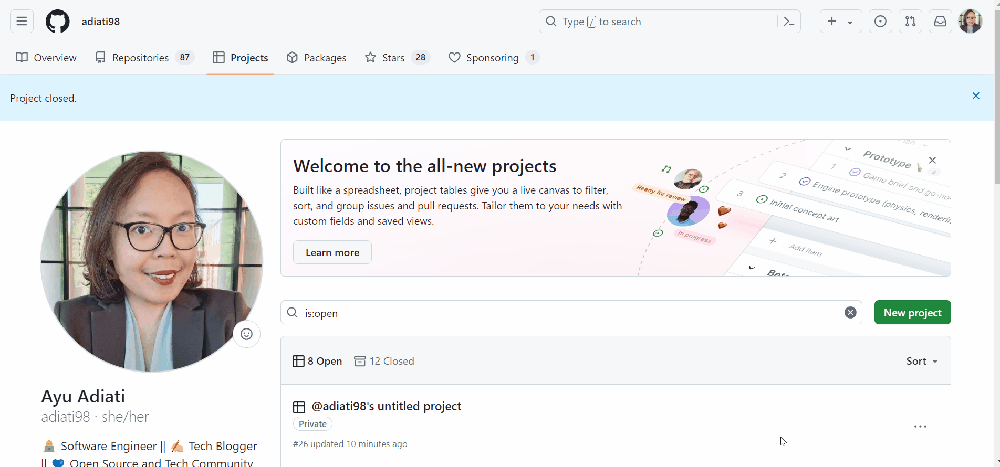

There are many things to consider when you think about how to start an open source project. In this portion of the course, we will walk through the key components every project needs to succeed.

## Detailed README

A README file contains an introduction to your open source project. A good README should be clear, concise, up-to-date, and detailed. This file is located in your root directory and serves as the first impression for your contributors.

Here are some things to consider inside your README:

- project title and summary
- brief instructions on how to set up the project
- images of the app and code examples
- tech and tools used in the project
- link to the contributing guidelines
- link to the code of conduct
- link to the open source license
- link to community Discord, Slack group, or GitHub Discussions

A README file is written in a markup language called [Markdown](https://www.markdownguide.org/), a popular language used in open source documentation like READMEs.

Here are a few examples of good READMEs:

- [OpenSauced App](https://github.com/open-sauced/app/blob/beta/README.md)
- [Astro documentation](https://github.com/withastro/astro/blob/main/README.md)
- [freeCodeCamp](https://github.com/freeCodeCamp/freeCodeCamp/blob/main/README.md)

## Installation Guide

This guide should include instructions for the following:

- forking the repository
- cloning the repository
- installing the dependencies
- setting up the environment variables
- setting up the database, if applicable
- running the project locally
- setting up Docker containers, if applicable

The best way to test your guide is by setting up the project locally using your guide. If you encounter issues getting your project to work, you will discover it quickly and can update the documentation to add or clarify the missing piece.

The installation guide is best placed at the top of your project's README file, as it is the most accessible file for your contributors.

Another good place would be in the CONTRIBUTING file. Besides providing guidelines about contributing to your project, this file can include installation setup, testing, linting, workflows, etc. You can place the installation instructions towards the top or bottom of your CONTRIBUTING file. You can take a look at [OpenSauced Contributing Guidelines](https://opensauced.pizza/docs/contributing/introduction-to-contributing/) as an inspiration.

If your project is on the larger side, consider having a separate documentation site and dedicating a section for installation there. You can use documentation site generators like [Docusaurus](https://docusaurus.io/), [Starlight](https://starlight.astro.build/), or [docsify](https://docsify.js.org/#/).

## Open Source Software License

You need to know that an open source project without a license is not available for anyone to use and distribute. Take a look at these explanations on [The Legal Side of Open Source](https://opensource.guide/legal/) on Open Source Guides:

> Making your GitHub project public is not the same as licensing your project. Public projects are covered by [GitHub’s Terms of Service](https://docs.github.com/en/site-policy/github-terms/github-terms-of-service#3-ownership-of-content-right-to-post-and-license-grants), which allows others to view and fork your project, but your work otherwise comes with no permissions.
>
> If you want others to use, distribute, modify, or contribute back to your project, you need to include an open source license. For example, someone cannot legally use any part of your GitHub project in their code, even if it’s public, unless you explicitly give them the right to do so.

So, every open source project must have a license written in a LICENSE file to grant further rights to other users. This file is typically located in the root directory for easy access for everyone.

### Choosing a License

An open source software license is a legally binding agreement between the software creator and the end users. It dictates how others can use, modify, or distribute your software.

Some licenses are more restrictive, like the GNU GPL (General Public License), while others are less restrictive, like the MIT license. Here are a few examples of licenses for OpenSauced projects:

- [OpenSauced Docs - MIT license](https://github.com/open-sauced/docs/blob/main/LICENSE)
- [OpenSauced App - Apache License 2.0](https://github.com/open-sauced/app/blob/beta/LICENSE)

To better understand which license would work best for your project, please look at these helpful resources:

- [How open source licenses work and how to add them to your projects](https://www.freecodecamp.org/news/how-open-source-licenses-work-and-how-to-add-them-to-your-projects-34310c3cf94/).
- [tl;dr Legal](https://www.tldrlegal.com/)

For a complete list of Open Source Initiative (OSI) approved licenses, please check out [their list](https://opensource.org/licenses/).

## Code of Conduct

A code of conduct is an established set of rules and behaviors that all open source participants agree to abide by. This document helps to ensure a healthy and inclusive environment for all involved with the project.

This set of rules and expectations will go inside a CODE_OF_CONDUCT file in the root directory of your project. Codes of conduct are generally divided into three main categories: pledge, standards, and enforcement.

:::info

Most open source maintainers will not write their code of conduct from scratch. Instead, they will add one using a [template provided by GitHub](https://docs.github.com/en/communities/setting-up-your-project-for-healthy-contributions/adding-a-code-of-conduct-to-your-project#adding-a-code-of-conduct-using-a-template) or copy and adapt from other codes of conduct and provide attribution.

:::

### Project Pledge

The opening pledge is a statement of the type of environment that the project wants to create. Here is an excerpt from the [OpenSauced Code of Conduct](https://github.com/open-sauced/.github/blob/main/CODE_OF_CONDUCT.md):

> In the interest of fostering an open and welcoming environment, we as contributors and maintainers pledge to making participation in our project and our community a harassment-free experience for everyone, regardless of age, body size, disability, ethnicity, sex characteristics, gender identity and expression, level of experience, education, socio-economic status, nationality, personal appearance, race, religion, or sexual identity and orientation.

### Project Standards

The standards section explicitly outlines what is considered acceptable and non-acceptable behavior by all project participants.

Here is an example from the [OpenSauced Code of Conduct](https://github.com/open-sauced/.github/blob/main/CODE_OF_CONDUCT.md):

> Examples of behavior that contribute to creating a positive environment include:
>
> - Using welcoming and inclusive language
> - Being respectful of differing viewpoints and experiences
> - Gracefully accepting constructive criticism
> - Focusing on what is best for the community
> - Showing empathy towards other community members
>
> Examples of unacceptable behavior by participants include:
>
> - The use of sexualized language or imagery and unwelcome sexual attention or advances
> - Trolling, insulting/derogatory comments, and personal or political attacks
> - Public or private harassment
> - Publishing others' private information, such as a physical or electronic address, without explicit permission
> - Other conduct which could reasonably be considered inappropriate in a professional setting

### Project Enforcement

You will want to explicitly state the consequence of what will happen if any member of the project behaves in an unacceptable way that violates your code of conduct.

Here is an example from the [OpenSauced Code of Conduct](https://github.com/open-sauced/.github/blob/main/CODE_OF_CONDUCT.md):

> Instances of abusive, harassing, or otherwise unacceptable behavior may be reported by contacting the project team at hello@opensauced.pizza. All complaints will be reviewed and investigated and will result in a response that is deemed necessary and appropriate to the circumstances. The project team is obligated to maintain confidentiality with regard to the reporter of an incident. Further details of specific enforcement policies may be posted separately.
>
> Project maintainers who do not follow or enforce the Code of Conduct in good faith may face temporary or permanent repercussions as determined by other members of the project's leadership.

### Contributor Covenant

The Contributor Covenant is a code of conduct you can use and adapt for your open source projects. To learn more, please visit the [official website](https://www.contributor-covenant.org/).

## Contributing Guidelines

A key aspect of learning how to start an open source project is developing contributing guidelines that outline the expectations and processes for all contributors. A CONTRIBUTING file contains guidelines on how contributors can help with your project. It is usually located in the project's root directory so everyone can easily access it.

Your guide should include the following sections:

- project setup instructions
- guidelines for creating new issues like bug reports and feature requests
- information about which issues are available for contribution
- guidelines for commit conventions for pull requests
- guidelines for code and style conventions
- guidelines for creating pull requests

For an in-depth look into creating a robust CONTRIBUTING file, please read [this article](https://dev.to/opensauced/how-to-make-a-delicious-contributing-guide-4bp3) by OpenSauced.

## Issue Templates

Issue templates help guide contributors in providing the specific and structured information needed when opening project issues. Having these templates in your repository will ensure you receive the desired information to triage the issue correctly.

You can create various issue templates, such as bug reports, feature requests, documentation updates, etc. Inside these templates, you can have required fields like steps for reproducing the bug or a details section for a feature request. You can also attach specific labels like `feature`, `needs triage`, or `bug` to inform the types of issue templates.

### Creating Issue Templates

There are two ways to create issue templates on GitHub.

#### 1. Using GitHub's Template Builder

To create issue templates using the GitHub's template builder, you will need to:

- go to your project's settings,
- navigate to the "Features" section,
- click on "Set up templates" under "Issues".

You can follow the [detailed guide](https://docs.github.com/en/communities/using-templates-to-encourage-useful-issues-and-pull-requests/configuring-issue-templates-for-your-repository#creating-issue-templates) on the GitHub documentation to create one.

#### 2. Using YAML Files

You can also create custom issue templates using YAML frontmatter:

- Create a folder called `.github` in the root directory.
- Add a folder called `ISSUE_TEMPLATE` inside the `.github` folder.

  :::note
  
  The name of this folder should be in all caps, or else it will not work on GitHub.

  :::

- Create a YAML file like a `bug.yml` or `feature.yml` file inside the `ISSUE_TEMPLATE` folder.

Here is the [bug report template](https://raw.githubusercontent.com/open-sauced/.github/main/.github/ISSUE_TEMPLATE/bug_report.yml) that we use at OpenSauced. To learn more about configuring issue templates, please visit the [official documentation](https://docs.github.com/en/communities/using-templates-to-encourage-useful-issues-and-pull-requests/configuring-issue-templates-for-your-repository) on GitHub.

## Pull Request Templates

Like issue templates, pull request templates allow you to guide your contributors in providing specific and structured information when opening pull requests in your project. This template will be in a file called `PULL_REQUEST_TEMPLATE.md`, which is usually located either in the root directory or the `.github` directory.

Here are a few things to consider inside your pull request template:

- section for contributors to describe the details of changes that were made and why
- section for the type of change made (e.g., bug fix, feature, style update, etc.)
- section to link corresponding issue tickets to the pull request (e.g., closes #123 or fixes #456)
- section to place screenshots and screen recordings, if applicable

Here is an example of a [pull request template](https://raw.githubusercontent.com/open-sauced/.github/main/.github/PULL_REQUEST_TEMPLATE.md) used by OpenSauced. Please read the [GitHub documentation](https://docs.github.com/en/communities/using-templates-to-encourage-useful-issues-and-pull-requests/creating-a-pull-request-template-for-your-repository) to learn more about creating pull request templates.

## Projects on GitHub

Keeping track of your issues is getting more challenging as your project progresses. A great tool that can help you organize and track your issues is [Projects](https://docs.github.com/en/issues/planning-and-tracking-with-projects/learning-about-projects/about-projects) on GitHub. With projects, you can efficiently manage your project's features, roadmaps, or releases as they're built from and integrated with issues and pull requests that you add.

You can choose a template for your project. One of the templates is the "Kanban" template. Here, you can create notes and place the existing issues and pull requests in the "Backlog", "Ready", "In progress", "In review", and "Done" columns. This will make it easy for you and your team to track the progress of your project.

To create a new project:

1. Navigate to your GitHub profile and click the "Projects" tab.
2. Click the green "New project" button.
3. Choose a template.
4. Name your project and click the "Create project" button at the bottom.

:::note

Projects are private by default. You can make them private to core maintainers or publicly visible to everyone.

:::

Please read the [GitHub documentation](https://docs.github.com/en/issues/planning-and-tracking-with-projects/managing-items-in-your-project/adding-items-to-your-project) to learn more about adding items to your project. 

Learning how to start an open source project involves understanding the importance of clear goals, community, comprehensive documentation, and ensuring quality contributions get merged into your project. The [next chapter](issues-and-pull-requests.md) will discuss handling open issues and pull requests.
