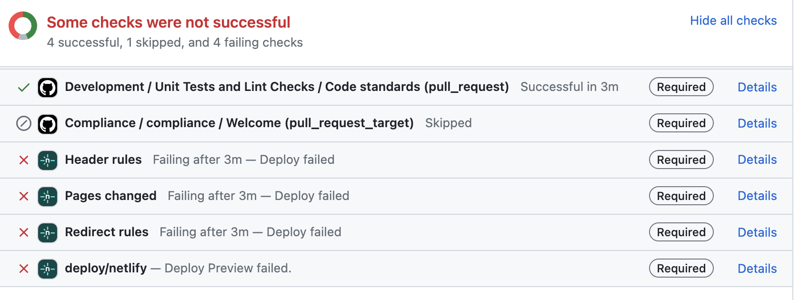
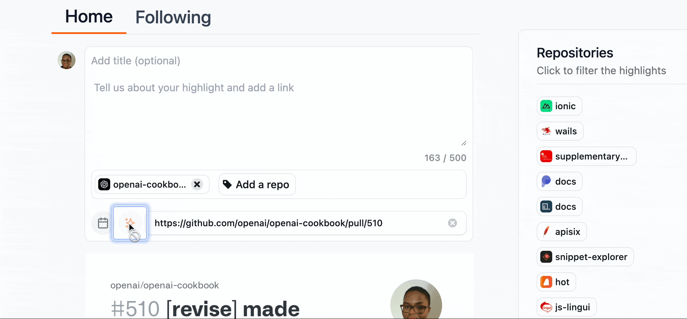

# How to Handle Open Issues and Pull Requests

One of the core responsibilities of an open source maintainer is triaging open issues and reviewing pull requests. In this chapter, we will talk about how to handle best open issues, pull requests, and security vulnerabilities.

## Issues Triage and Management

Issue triage involves reviewing an existing list of open issues and prioritizing them in order of importance. The following sections will break down the most common types of issues and how to best triage and respond to contributors.

### Bug Labeled Issues

When triaging bug issues, you want to make time to reproduce the bug to understand the problem. If you cannot reproduce the bug, reach out to other team members to see if they can reproduce it. If you are a solo maintainer, reply to the issue's original poster to gain more information and context.

Then, you need to define whether the bug is considered critical, medium, or small.

#### Critical Bugs

When an open issue contains a bug that is a major blocker and has affected the functionality of the whole application or website, you can consider it as high priority or critical. This kind of bug has to be fixed immediately.

Labeling these issues as `critical` or `high-priority` is best so the team knows they must address them first. Consider using labels in different colors. Bright red or orange label colors are a good choice because they indicate the level of seriousness and are easier to spot in a list of issues.

For critical bug fixes, it is best to have core team members or regular contributors work on these issues to ensure that it is done well and promptly. You can use a label like `core team work` to indicate that this issue is only open for select members.

#### Small to Medium Bugs

A bug that is not affecting the functionality of your application is not considered critical. You can categorize bugs as medium-level when you can fix them after deploying an upcoming release. Those you may or may not include in the development are considered small bugs.

You can open these issues up for anyone to work on. Some of these issues might be small enough that it would be a good opportunity for a new contributor. Label the issue with a `good first issue` or `first timers only` in this situation.

### Feature Labeled Issues

When triaging feature requests, you want to ensure it is a good fit for your project and that you are interested in adding it. Reach out to the original poster of the issue to see if they want to work on it. If they agree, go ahead and assign that issue to them. Otherwise, add a `help wanted` or `accepting PRs` label on it.

Suppose the feature is a good fit for the project but is complex. Consider working on it yourself or having a core team member assigned. Large features affecting many files and moving parts in your application should be handled by someone experienced with the codebase and won't create more problems.

Sometimes, users will ask for features already on the roadmap or being worked on by another contributor. If so, you can politely respond to let them know about the status. Here is a template that you can use for a response:

> Thank you for taking the time to open this issue. Another team member is working on this feature, which will be added soon. As a result, we are going to close this issue.

If a feature request does not sound like a good fit for your project, you can respond to the original poster and close the issue. Here is a template that you can use for a response:

> Thank you for being so interested in our project. The feature you have proposed would not be a good fit for this project's current scope and direction. At this time, we will not be moving forward with this feature.

### Documentation Labeled Issues

If the issue has to deal with minor typos or grammar mistakes, add a `good first issue` label to open it up for new contributors. If the issue is more involved, you will need to evaluate the priority level and add a `help wanted` label. Also, in these situations, you might need to get more information from the original poster before opening it up for contribution.

### Spam Issues

If an issue is clearly a spam or unhelpful message, you don't need to engage with the poster. Instead, close the issue and add a `spam` label. Here is an example of a spam message:

> This project is terrible! Nothing works, and your code is garbage. I can't believe anyone would use this. Fix it ASAP!!!111!!1!

There are no concrete details on the issues in that situation, and the poster is clearly combative. It is important to refrain from engaging with these types of users. You can close the issue and move on.

### Insufficient Information Issues

If the user does not provide concrete details about the issue, kindly respond by asking them for more information. If it is a bug report, ask for more details on reproducing it. If it is a feature request, ask for clarification on style or functionality changes.

Some users will quickly respond to replies, while others might take longer. If you don't hear a response within a week, you can message them again for more details. If a few weeks pass and the issue is not considered critical, go ahead and close the issue.

### Stale Issues

Issues that haven't been worked on for months are considered stale. Sometimes, you might be interested in resurrecting this issue and making it a higher-priority item. If that is the case, then go through the normal triage process and add the appropriate labels.

But other times, you might realize this is an issue that you prefer not to work on. If that is the case, go ahead and close it for good. Some maintainers automate this process using actions like [Close Stale Issues and PRs](https://github.com/actions/stale).

## Pull Requests Reviews

There are many things to consider when reviewing pull requests. This next section will discuss how to provide good feedback and work with contributors on their pull requests.

### Effective Code Reviews

Code reviews should be informative, constructive, and helpful for the reviewer and author. Remember that contributors have volunteered their time to help your project. You want to ensure your review is generally positive and informative. It would be best if you considered using phrases like this:

> "Let's use more descriptive variable names for better readability. Instead of variable d here, let's go with days_until_deadline".

While it is important to provide detailed reviews, you want to specify which changes are absolute fixes versus which ones are suggestions and nitpicks. If something is broken or hard to read/understand, then that should be something fixed in the pull request. Consider saying something like the following:

> "This is a breaking change, and we should change it to be this instead."

If your suggested changes are minor suggestions or nitpicks, make sure to indicate that in your review. That lets the author decide whether to incorporate those changes in their pull request.

### Manual Testing

If a pull request involves a small change to documentation or code, manually testing the changes is unnecessary. But if the pull request involves significant changes to the project, it is best to test the changes yourself to ensure that everything is working properly.

If you have deployed previews set up through a service like [Netlify](https://docs.netlify.com/site-deploys/deploy-previews/) or [Vercel](https://vercel.com/docs/deployments/preview-deployments), that is a good first step to manually testing the changes. If you don't have previews set up, you should pull down the project locally to manually test the changes. It is essential to take your time to manually test everything because you are the last line of defense before a pull request is merged in. A new set of changes can break the application without proper testing.

When the pull request has broken a part of the application, respond to the author with a detailed account of what went wrong. Sometimes, it helps to include a screenshot or screen recording to show what is broken. If your automated tests did not catch the breaking change, you should open up a separate issue to update your test suite. And if you don't have a test suite setup to run on every pull request, this is a perfect time to set that up.

### Missing Tests

Not all pull requests will need tests because they are small code changes or updates to documentation. However, for larger features or refactors, tests should be added to help ensure that everything is working as expected. If the pull request author has not set up tests, reach out to them on the pull request to let them know what parts need to be tested. It also helps to outline adding tests in your documentation as an expectation.

### Failing Automated Tests

Sometimes, contributors will open a pull request that fails a few of your automated tests. It is best to wait a few days after the pull request is opened to allow the contributor to address the failing tests and resolve the issue independently. If they are not addressing the issue, reach out to them on the pull request and ask if they need help. When they do, look into why the test is failing and provide constructive feedback on how they can fix it. If the failing test is unrelated to their changes, let them know that it is safe to ignore it and that it will be fixed in another pull request.

If the author does not address the issue or respond to your initial comment, reply with suggested fixes and reiterate that you are here to help. After several weeks or months without the author's response, close the pull request and move on.

If multiple contributors fail the same set of tests, the tests may be flaky or broken and need your attention. In those situations, you want to clarify to the contributor that the failing test is not their fault and will be resolved.

### Spam Pull Requests

There might be times when you will get a spam pull request for your project. In these situations, it is best not to respond to the author. Instead, close it and add a `spam` label on it.

Here are some examples of spam pull requests:

- whitespace changes to the README file or other files
- random changes to files without an accompanying issue or explanation
- numerous links to unrelated websites or promotes products/services
- plagiarized content from other sources without permission or proper attribution

### Low-Quality Pull Requests

Low-quality pull requests, unfortunately, take a lot of time and energy from the maintainer. Here are a few examples of low-quality pull requests:

- unfinished pull requests that do not address the entire issue
- code that does not fit within the established style guide for the project
- incomplete pull request forms that do not provide sufficient information on what changes were made
- address multiple issues at once and make it challenging to review

If you receive a pull request that is lower in quality, reach out to the author, explaining what needs to be added and what changes need to be made. Most of the time, contributors might not be aware of these issues and need extra explanation and time to improve their pull requests.

### Stale Pull Requests

Sometimes, pull requests can remain open for weeks or months at a time. They're not considered stale pull requests if they have regular updates and conversations. If there has been little to no activity for several weeks, you must contact the contributor to see if they need help or are still interested in working on it.

If you have repeatedly tried to reach out and get no response, you should close the pull request or take it over. If you are taking it over, tell the contributor you are bringing this to the finish line because it is blocking other pull requests.

## Issue and Pull Request Highlights with OpenSauced

The [Highlights](https://docs.opensauced.pizza/features/highlights/) feature on OpenSauced is a place for you to showcase recent achievements with the open source community. This is a place to introduce your project to potential new contributors and talk about issues that need attention from the community.

### Issue Highlights

When writing issue highlights, you will want to talk about the issue, how the contributor solved it, and how the solution impacted the project. Once you post a highlight on OpenSauced, re-share it on other platforms like Twitter or LinkedIn for increased visibility. Regularly acknowledging and thanking your contributors, especially in public, will strengthen their loyalty to the project and attract new contributors.

### Pull Request Highlights

When writing pull request highlights, you will want to talk about the changes made, acknowledge the author, and showcase how this improves the project. Link the pull request in your highlight for those interested in taking a closer look at the changes made. This is another way to gain attention for the project because it is a first-hand look at what types of contributions you are looking for and how well you work with contributors.

To learn more about how the Highlights feature works, please read through the [OpenSauced documentation](https://docs.opensauced.pizza/features/highlights/).

## Promptly Respond and Address Concerns

When you have incoming issues and pull requests, scheduling time for triage and reviews is essential. Design a regular schedule that works for you to triage contributor issues and provide detailed pull request reviews during the week.

You should not feel pressured to respond to new open issues or pull requests immediately. It is okay if they are left unread for a few days. If a contributor pushes you for a review or comment on an issue or a pull request, politely respond that you will get to it when you have time. You can also set up your own [GitHub Actions](https://docs.github.com/en/actions) to automate responses to new issues and pull requests, letting contributors know you will get to it when available. You can learn how to set one up in [this article](https://dev.to/opensauced/github-actions-a-maintainers-best-friend-488n).

If contributors have concerns about the project, you will want to create a safe space to make them comfortable talking about these issues. If they have concerns about the code or security aspects, feel free to discuss it on an open issue or even privately through Discord or Slack.

## Task Prioritization and Realistic Timelines

Juggling all the tasks to maintain an open source project can be difficult sometimes. Set aside time each week to triage issues and look through the project backlog to prioritize work to be done. Choose when to label issues and pull requests as a high priority. Realistically, there will always be issues that should be considered a top priority, while you can address the rest later.

When setting realistic timelines, add an extra few days to your work estimate. If you think a new set of features will take a couple of weeks, tack on each week. Issues come up all of the time in projects. So you want to avoid timeboxing yourself to a very strict deadline when it wasn't realistic in the first place.

When working with other volunteer contributors, allow extra time to complete the work. If they volunteer their time, they may run into other commitments which will delay their availability for you. It is crucial to lead with empathy and understanding and not demand that they adhere to a strict deadline like an employee would.

## Security Vulnerabilities Handling

In case security issues arise within your project, your contributors must be aware of the optimal methods for reporting them. It would be best to have a policy for reporting security vulnerabilities stored in the `SECURITY.md` file. This file is usually added to the project's root or `.github` directory. It would also be good to link to the security file in your README file for easier community access.

A lot of maintainers will choose to go with this security policy template:

> GitHub's [Bug Bounty program](https://bounty.github.com) rewards researchers for discovering security vulnerabilities in a number of repositories. The full list of projects that are eligible for rewards are [available on our Bug Bounty site](https://bounty.github.com/#scope).
>
> If the repository is eligible for rewards, you can submit a report via [HackerOne](https://hackerone.com/github). You can find more useful information in our [rules](https://bounty.github.com/#rules) and [FAQ](https://bounty.github.com/#faqs).
>
> For repositories not covered by the Bug Bounty program, please open an issue.

### Dependabot

Dependabot is a GitHub feature that monitors your project's dependencies and reports any possible security vulnerabilities. You can configure Dependabot to report issues or create pull requests to update dependencies with security vulnerabilities. To learn more about this feature, please read through the [GitHub documentation](https://docs.github.com/en/code-security/getting-started/dependabot-quickstart-guide).

Let's move to the [next chapter](communication-and-collaboration.md), which will discuss how to communicate and collaborate effectively.

<footer>
  <a href="https://github.com/open-sauced/intro/blob/main/docs/becoming-a-maintainer/issues-and-pull-requests.md">✏️ Edit this page</a>
</footer>
