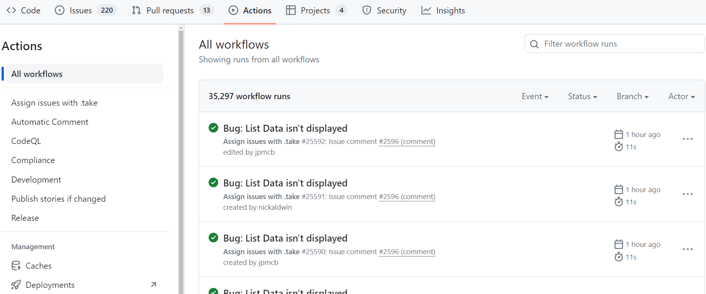
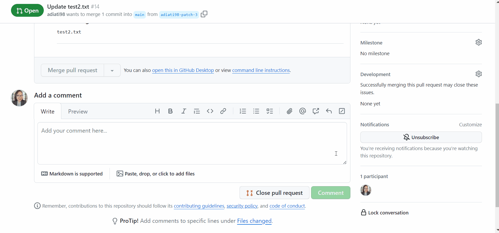

# Maintainer Power Ups

Maintainers have a variety of daily tasks. You often juggle triaging new issues, reviewing pull requests, testing changes, and managing and moderating the community, such as welcoming new contributors and thanking contributors for their contributions. Most of the time, you are expected to respond to these tasks promptly. Sometimes, these never-ending tasks take too much time and are overwhelming. It would help if you were efficient in what you do.

The good news is that some tools and features on GitHub allow you to automate tasks, which can help you save time and make your work lighter. In this chapter, we will talk about these maintainer power ups from GitHub.

## GitHub Actions

Let's say your project receives more new issues and pull requests daily. You want to welcome each new contributor, thank them for their contributions, and tell them you will triage their issues and review their pull requests. You want to do more but don't have time to respond to them because you're still busy with something else.

Setting up actions to automate these tasks will save you time responding to contributions individually. You can decide which actions to include in each repository.



### Types of Actions

There are many types of actions that you can set up for your project, depending on what you need. Below are some GitHub Actions that you usually find across repositories:

#### Linter

Most open source repositories have linters that run on each pull request. Linter is a tool for detecting potential errors and maintaining a consistent code style in a project. [Super-Linter](https://github.com/marketplace/actions/super-linter) is one of the most used actions. This action can help you maintain code quality and achieve a more readable and consistent style.

#### Deployed Previews

You want to be able to view changes, especially visual ones, without shipping them to production. Having these previews in every pull request with [Netlify](https://docs.netlify.com/site-deploys/deploy-previews/) or [Vercel](https://vercel.com/features/previews) lets you preview changes before merging the pull request.

#### Issue and Pull Request Scripts

Having scripts to welcome new issues and pull requests and let contributors know that you will triage and review them will save you more time than writing them manually, one by one. You can use the [Create or Update Comment](https://github.com/marketplace/actions/create-or-update-comment) action, as we do here at OpenSauced, to [welcome new issues](https://github.com/open-sauced/app/blob/beta/.github/workflows/issue.yml).

#### Code Scanning Tools

Code scanning is a tool for detecting security vulnerabilities, possible bugs, and errors in code. You can use GitHub's [code scanning](https://docs.github.com/en/code-security/code-scanning) feature and configure tools like [CodeQL](https://docs.github.com/en/code-security/code-scanning/introduction-to-code-scanning/about-code-scanning-with-codeql), which GitHub maintains, or third-party scanning tools such as [SonarQube](https://github.com/marketplace/actions/official-sonarqube-scan).

#### Testing

Setting up actions to run tests is helpful to ensure your app functions and performs as it should and that no regressions occur with new changes. [Cypress GitHub Action](https://docs.cypress.io/guides/continuous-integration/github-actions) is one of the examples of actions for E2E testing. You can also check out [Is Website Vulnerable](https://github.com/marketplace/actions/is-website-vulnerable) to find publicly known security vulnerabilities in JavaScript libraries' websites or [Step CI Action](https://github.com/marketplace/actions/step-ci-action) for API quality assurance.

### Creating and Customizing Actions

You can search for available GitHub Actions on the [GitHub Marketplace](https://github.com/marketplace?type=actions). But if you can't find the one you need, you can create or customize your own actions from existing GitHub Actions.

Brian Douglas, the founder of OpenSauced, created [Take Action](https://github.com/marketplace/actions/contributor-takes-action). This action allows contributors to assign themselves to an issue by typing the `.take` command in the issue's comment, allowing maintainers to focus on more important tasks than assigning issues.

However, we want contributors only able to take issues that have passed our triage or are not meant to be worked on by the core team. So, we create the [Triage Action](https://github.com/open-sauced/app/blob/beta/.github/workflows/triage.yml) that will block the Take Action whenever a `needs triage` or `core team work` label exists.

You can read more about GitHub Actions and how to create one in [the official documentation](https://github.com/features/actions).

Here are some more resources to give you more information about GitHub Actions and how to set one up:

- [GitHub Actions: A Maintainer's Best Friend](https://dev.to/opensauced/github-actions-a-maintainers-best-friend-488n)
- [Setting Up Your First GitHub Action](https://dev.to/opensauced/setting-up-your-first-github-action-for-specific-contributions-33a4)

## CI/CD Pipelines

Leveraging GitHub Actions to bring Continuous Integration / Continuous Delivery or Deployment (CI/CD) into your workflow directly in your repository will let you run code, test, build, and deliver or deploy software with simple and secure workflows. Automating these tasks will speed up your deployment process.

Using Git, GitHub, and GitHub Actions to build a CI/CD pipeline should give you confidence in your code.

### Continuous Delivery vs. Continuous Deployment

From the official [GitHub Resources](https://resources.github.com/ci-cd/):

> In a CI/CD pipeline that uses continuous _delivery_, automation pauses when developers push to production. A human—your operations, security, or compliance team—still needs to manually sign off before final release, adding more delays.
>
> On the other hand, continuous _deployment_ automates the entire release process. Code changes are deployed to customers as soon as they pass all the required tests.

A project usually starts with continuous delivery and integrates more automated testing over time.

### Build a CI/CD Pipeline with GitHub Actions

Below are some helpful resources to help you build a CI/CD pipeline with GitHub Actions:

- [GitHub Docs: The complete CI/CD solution](https://github.com/solutions/ci-cd/)
- [How to build a CI/CD pipeline with GitHub Actions in four simple steps](https://github.blog/2022-02-02-build-ci-cd-pipeline-github-actions-four-steps/)

## GitHub CLI

[GitHub CLI](https://cli.github.com/) is an open source tool that enables you to use GitHub from your computer's command line. It allows you to:

- forking and cloning repositories,
- checking out a pull request and reviewing it locally,
- creating issues and pull requests,
- viewing a pull request, issue, or repository right from your terminal.

Using the GitHub CLI will save you time and boost your productivity as a maintainer. You don't need to switch between the GitHub website and your terminal.

Visit the [GitHub CLI repository](https://github.com/cli/cli#installation) for information on installing GitHub CLI on your machine, and read [this blog post](https://dev.to/opensauced/boost-productivity-with-the-github-cli-2mne) to get started.

## Issues and Pull Request Templates

Have you ever found yourself in a situation where you're reviewing pull requests or triaging issues, but you can't understand what's happening because contributors didn't provide sufficient information? Or, have you had to close an issue or pull request because the description, screenshot, or other crucial information was missing?

The good news is that you can address these problems by creating issue and pull request templates. These templates allow you to customize and standardize it to include necessary information. You can see them as guides for contributors to follow when writing an issue or pull request for your project. Creating templates saves time on triaging issues, reviewing pull requests, and ensuring you get all the information you need from your contributors. Additionally, future contributors can benefit from these templates by understanding the history of changes made, which can help them debug or understand the code involved.

You can learn more about [configuring issue templates](https://docs.github.com/en/communities/using-templates-to-encourage-useful-issues-and-pull-requests/configuring-issue-templates-for-your-repository) and [creating a pull request template](https://docs.github.com/en/communities/using-templates-to-encourage-useful-issues-and-pull-requests/creating-a-pull-request-template-for-your-repository) on the official GitHub documentation.

## Saved Replies

Sometimes, you repeatedly write the same reply to issues or pull requests. Clear communication between maintainers and contributors is crucial. So, when you write all comments manually, your messages will no longer be consistent and may be unclear. You can create saved replies when you frequently respond to issues and pull requests with the same comments.

[Saved replies](https://docs.github.com/en/get-started/writing-on-github/working-with-saved-replies/about-saved-replies) allow you to create a reusable response to issues, pull requests, and discussions and use it across repositories. It will save you time responding to contributors while keeping the consistency of your message. You can always modify your replies if necessary.

Read the GitHub documentation for complete instructions about how to [create saved replies](https://docs.github.com/en/get-started/writing-on-github/working-with-saved-replies/creating-a-saved-reply).



## Code Owners

Most of the time, contributors don't know the maintainers of a project, so they don't know who to reach out to review their pull requests. When they create a pull request, they usually leave a comment without tagging anyone, like, "Can you please review my PR?" Without being tagged, maintainers don't get notified about this new pull request and comment, causing it to be missed from the radar. Adding the CODEOWNERS file to the repository will help you to automate and tackle this issue.

From the [official GitHub documentation](https://docs.github.com/en/repositories/managing-your-repositorys-settings-and-features/customizing-your-repository/about-code-owners):

> You can use a CODEOWNERS file to define individuals or teams that are responsible for code in a repository.

Here is an example of a [CODEOWNERS file](https://github.com/open-sauced/docs/blob/main/.github/CODEOWNERS) in the OpenSauced docs repository that contains code as below:

```text
* @open-sauced/docs
```

This syntax means that the `@open-sauced/docs` team will be the default owner for everything in the repository and will automatically added as reviewers whenever someone creates a pull request.

!> If you want to match two or more code owners with the same pattern, all the code owners must be on the same line.

There are some benefits to having this file in your repository:

- **Review request notification**

  Once you have specified who can review and maintain a repository, these code owners are automatically notified and requested for review when someone opens a pull request that modifies code that they own. That way, you don't need to add reviewers manually.

- **Prevent contributors from manually adding reviewers**

  Setting up the CODEOWNERS file prevents external contributors from manually adding reviewers because it automatically adds them. That way, contributors don't have to comment and tag anyone on the comment to review their pull request. It also helps you to stop them from adding non-maintainers — such as regular contributors — as reviewers.

- **Branch protection**

  If you opt-in to "Require approval" and "Require review from Code Owners" to protect a branch, a certain number of code owners must approve any pull request before it can be merged into the protected branch. This can reduce the chance of merging pull requests that can break production.

Now that you understand the basics of what maintainers do and the tools, the [next chapter](your-team.md) will teach you how to build your team.

<footer>
  <a href="https://github.com/open-sauced/intro/blob/main/docs/becoming-a-maintainer/maintainer-powerups.md">✏️ Edit this page</a>
</footer>
