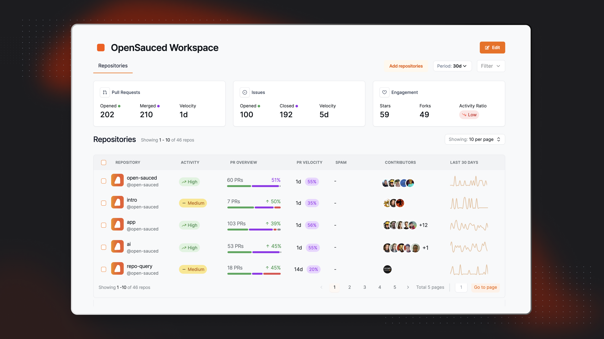
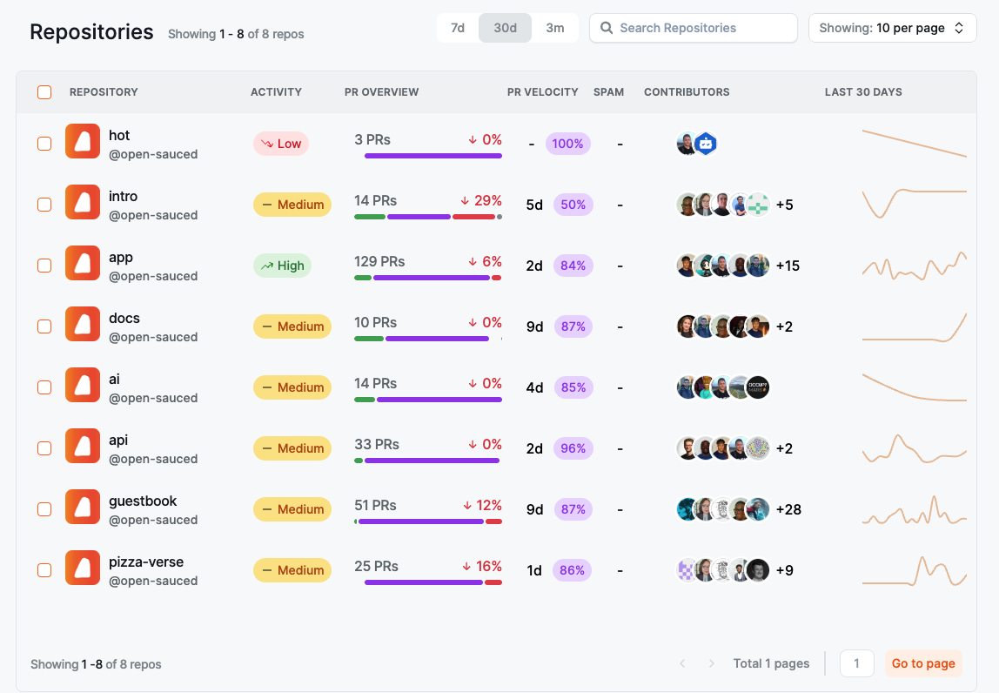
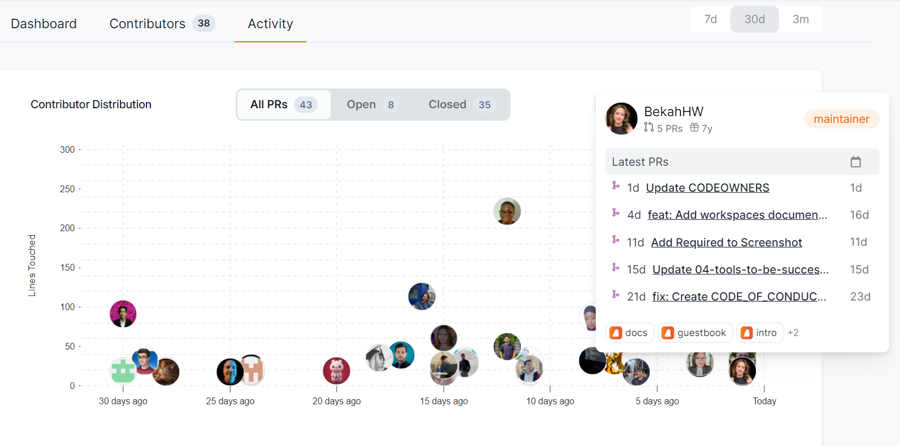
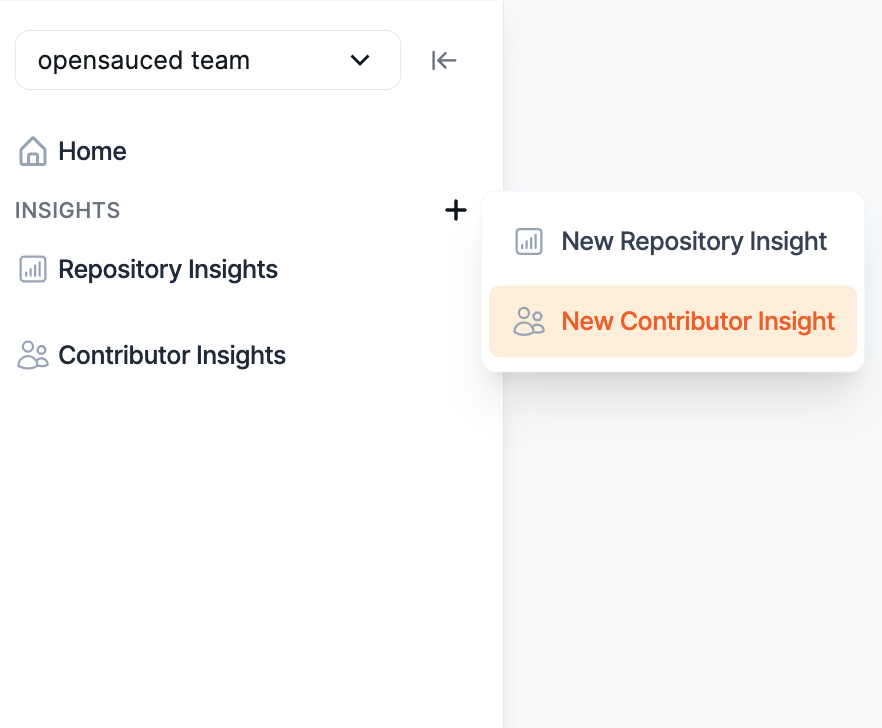
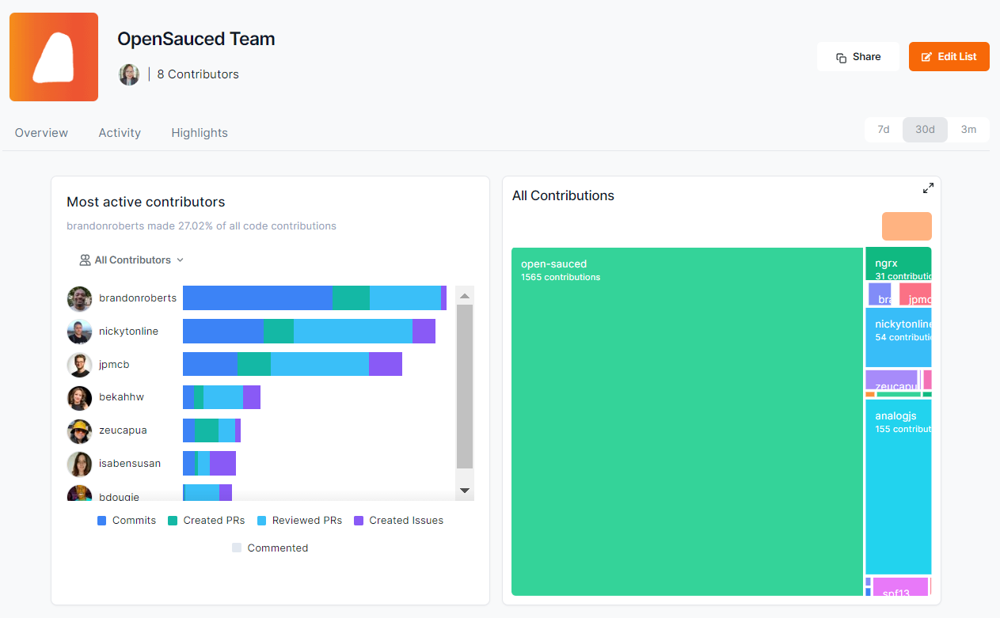

Understanding what's happening with your project and contributors as it grows can be challenging for new maintainers. Think of metrics and analytics like a compass and map in your maintainer journey. Understanding metrics for open source projects and your own project can help you to set goals, identify project needs, and understand your community. This chapter will guide you through understanding, leveraging, and making decisions based on these insights to create a thriving open source project.

## Understanding Types of Metrics

- **Code Metrics:** Code metrics provide a quantitative measure of the codebase's state, focusing on aspects that impact its quality, maintainability, and scalability.
- **Community Metrics:** Community metrics shed light on the human element of the project, highlighting the growth, engagement, and overall health of the surrounding community.
- **Project Health Metrics:** Project health metrics provide insights into the project's responsiveness, efficiency, and overall well-being.

Considering a holistic approach to metrics can ensure you're not overly focused on one type to the detriment of others. For example, while high code quality is important, it should be balanced with strong community engagement to ensure a sustainable project future.

Diverse metrics offer a more complete picture of a project's health and potential areas for growth or improvement. This could include balancing code metrics with community and project health metrics to ensure the project is not only technically sound but also welcoming and engaging for new contributors. It's about finding the right mix that supports your project's goals and values, fostering an environment where the codebase and the community thrive together.

## Setting Project Goals

Setting clear and achievable goals can help you with project management. can help you with project management. Your goals might vary and include improving code quality, expanding the community, or streamlining issue resolution. When you set specific goals, you're better able to make decisions about prioritization and using resources (don't forget, time is a resource!).

Remember, goals for your open source project are final. They will evolve as the project grows. Metrics can inform these changes, providing insights that reveal new opportunities or challenges. For instance, if a project sets an initial goal to increase contributor numbers but later finds that engagement or quality is suffering, it might shift focus towards improving onboarding processes or documentation.

Maintainers should regularly review their goals in the context of the project's current metrics and broader trajectory. This adaptability ensures the project remains aligned with its community's needs and your vision as a maintainer.

Choose metrics that align with your project's priorities. For example, if community growth is the goal, focus on new contributor rates and engagement levels. Below are some examples of metrics you may want to track.

### Community Growth Goals

- **New Contributor Rates**: Tracking new contributors can be a key indicator of your project's appeal and growth potential.
- **Active Contributors**: The count of contributors who have made at least one commit, pull request, or comment in the last month.
- **Community Engagement**: Engagement metrics might include the number of comments on issues and pull requests, PR reviews, or the number of members in your community space (Slack, Discord, etc.).
- **Retention Rate**: The percentage of new contributors who continue contributing over time, indicating how well the project retains its community members.

### Code Quality Goals

- **Documentation Coverage**: Having documentation coverage ensures your project is accessible to newcomers and reduces the entry barrier for contributors.
- **Commit Frequency**: Knowing the commit frequency can help you understand the project's development activity over time and can help you identify trends in contribution, potential stagnation, or support needs.

### Project Health Goals

- **Issue Velocity**: How quickly issues are closed. This can reflect how quickly the concerns are acknowledged, an important aspect of project responsiveness.
- **Pull Request Velocity**: How fast pull requests are closed. This can help you see how efficiently problems are solved.
- **Benchmarking**: Use OpenSauced to establish current metrics as benchmarks, setting realistic targets for improvement.
- **Timeline**: Set a clear timeline for achieving these goals, creating a sense of urgency and momentum.

## Understanding and Interpreting Open Source Project Data

Understanding and interpreting data helps us to understand and share the story behind the numbers. Some ways to do this include:

- **Trend Analysis**: Look for patterns over time, such as cyclical increases in contribution activity, to plan for future resource allocation.
- **Anomaly Detection**: Identify unexpected spikes or drops in metrics and investigate potential causes, such as new feature releases or community events.
- **Comparative Analysis**: Compare metrics against similar projects to gauge your project's performance in the broader open source ecosystem.

## Making Data-Driven Decisions

Making data-driven decisions involves using the insights you've gathered to guide your project's direction.
For example, if you see that your project has a high number of new contributors but a low retention rate, you might decide to focus on improving the onboarding process for new contributors.

A great way to make data-driven decisions about your project is to create a Workspace in OpenSauced. This will allow you to bring together repositories, insights, and collaboration tools in one place.

## Creating a Workspace for Your Project with OpenSauced

An OpenSauced [Workspace](https://docs.opensauced.pizza/features/workspaces/) serves as your project's command center, where you can learn more about your project and share it with others. This section guides you through creating and optimizing a Workspace to manage your project efficiently.

To create a Workspace:

1. Log in to your [OpenSauced account](https://app.opensauced.pizza/). Once you're there, click the "Workspace" on the top bar, and you should see your personal workspace.
2. Click on the "Edit" button. You'll be prompted to name your workspace and add repositories.
3. Add your project's repository.
4. Click "Create Workspace" to create your Workspace.

Within the Repositories dashboard, you can view the following metrics, which are over a period of thirty days by default:

- **Pull Requests**: This includes the total opened and merged pull requests for the repositories included in your workspace, as well as the velocity of pull requests being merged.
- **Issues**: This includes the total opened and closed issues for the repositories included in your workspace, as well as the velocity of issues being closed.
- **Engagement**: This includes the total stars, forks, and activity ratio for the repositories included in your workspace.

:::tip

You can customize the time period for these metrics by selecting 7 days, 30 days, or 90 days from the dropdown menu.

:::

If you want to benchmark your project against other similar projects or if you'd like to create a list of repositories for inspiration, you can create a [Repository Insight](https://docs.opensauced.pizza/features/repo-insights/) in your Workspace.

### Creating a New Repository Insight Page

To connect and track repositories, click the "+" next to "Insights" in the sidebar, then select "New Repository Insight." You will be redirected to a page where you can create your new Repository Insight Page.

#### Using Your Repository Insights Page

Once you have connected your repositories, you will be redirected to your Repository Insight Page. Here, you will see a dashboard with an overview of the repositories and the contributors who have contributed to them.

There are three tabs that provide you with more information on these repositories:

##### Repositories Dashboard

This dashboard allows you to view more detailed information on each repository, including activity levels, PR overview, PR velocity, spam PRs, contributors, and activity stats over the last 30 days.

:::tip

To learn and understand more about the data provided, see [Understanding Repository Insights Data](https://docs.opensauced.pizza/maintainers/understanding-repo-insights/).

:::

##### Contributors Dashboard

The Contributors dashboard allows you to view more detailed information on each contributor, including their activity levels, the number of repositories they contributed to, the date of their last contribution, their most used language, their time zone, the number of contributions, and their activity stats over the last 30 days.

You can select and add your contributors to a [Contributor Insight Page](https://docs.opensauced.pizza/features/contributor-insights/) to learn more about them.

##### Activity Dashboard

The Activity dashboard shows a graph of the last time each contributor created their PR and how many lines of code they've touched. It also provides more detailed information on each contributor when you hover over their image, including their latest PRs and repositories they've contributed to. Clicking their image will bring you to their profile on OpenSauced.

You can use the information in this dashboard to help you learn about their engagement and general interests. It will be helpful if you want to collaborate with them or consider recruiting a maintainer for your project.

You can create a Contributor Insight Page to track your contributors and ensure you're growing a healthy open source community.

### Creating a Contributor Insight Page

OpenSauced Contributor Insights feature allows you to categorize, monitor, and analyze various groups of contributors. This feature offers insights into each contributor's activities and contributions, helping you to track individual contribution histories, identify active engagement, recognize new or alumni contributors, and compare the performance of different contributors.

The Contributor Insights features allow you to:

- track the commits and PRs of the contributors on your list
- filter your contributors by their activity level, including most active, new, and alumni
- view the repositories your contributors have contributed to, the top programming languages they've used, and their time zones

In terms of tracking metrics to understand your contributors, here are some things you could look at:

- **Engaged contributors**: Keep tabs on contributors actively interacting with your repository.
- **VIP contributors**: Highlight and track contributors you've identified as key maintainers or significant contributors.
- **Alumni contributors**: Keep an eye on contributors who have decreased their engagement or left the project.

To create a new Contributor Insight Page:

1. Click the "+" next to "Insights" in the sidebar.
2. Click "New Contributor Insight." You will be redirected to a page where you can create your new Contributor Insight Page.

   

3. Give your page a name.
4. Add contributors to your page by searching for their GitHub username, syncing your GitHub Team, or importing your GitHub Following.

   

#### Using Your Contributor Insight Page

Once you have created your page, you will be redirected to your Contributor Insight Page. Here, you will see a dashboard with an overview of the contributors.

There are three tabs that provide you with more information on these repositories:

##### Overview Dashboard

The Overview dashboard gives you a high-level view of the contributors in your Contributor Insight Page, including the total number of commits in the last 30 days and the types of contributors: Active, New, and Alumni.

##### Activity Dashboard

The Activity dashboard gives you a graph view with more detailed information on each contributor, including the type of activity, repositories they've contributed to, and how they compare to each other.

You can filter your Contributor Insight Page by All Contributors, Active Contributors, New Contributors, and Alumni Contributors.

##### Highlights Dashboard

The Highlights dashboard gives you a list of the highlights that the contributors listed on your page have created. This is a great way to see what other contributors are up to and to show them support.

:::tip

To learn and understand more about the data provided, see [Understanding Contributor Insights Data](https://docs.opensauced.pizza/maintainers/understanding-contribs-insights/).

:::

### Leveraging OpenSauced for Project Success

Embracing metrics and analytics through OpenSauced gives you the knowledge to make informed decisions and foster a culture of transparency and continuous improvement. By setting clear goals, analyzing project data, and engaging with your community, you create a foundation for sustained growth and success. Remember, the open source journey is a marathon, not a sprint. With OpenSauced, you have a partner every step of the way, guiding your project toward achieving its full potential.

It's time to put what you've learned into practice! Let's move on to the [next chapter](getting-practical.md).
