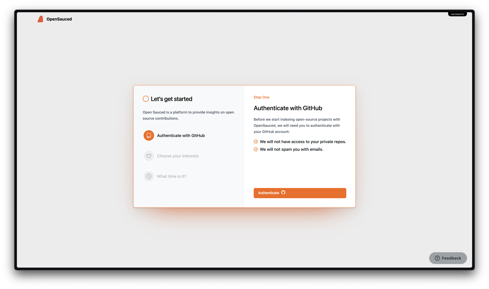
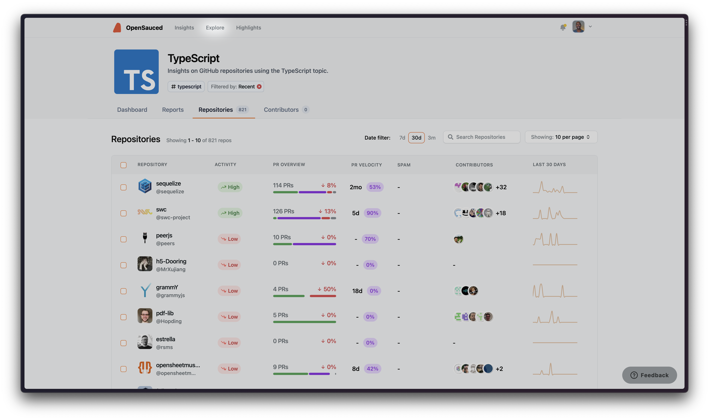
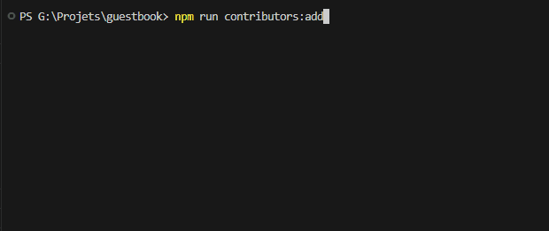

# Comment contribuer à l'open source

Dans ce chapitre, nous vous guiderons à travers le processus de contribution aux projets open source.

## Trouver des projets sur lesquels travailler

L'un des premiers défis auxquels vous pouvez être confronté lorsque vous vous lancez dans l'open source est de trouver un projet auquel contribuer. Voici quelques conseils pour vous aider à découvrir des projets qui correspondent à vos intérêts et à vos compétences :

1. **Parcourez GitHub et GitLab** : GitHub et GitLab hébergent tous deux un grand nombre de projets open source. Vous pouvez utiliser leur fonction de recherche pour trouver des projets basés sur des mots-clés, des langages de programmation ou des sujets spécifiques.

2. **Suivez vos intérêts** : Réfléchissez aux outils, aux cadres et aux bibliothèques que vous utilisez ou sur lesquels vous souhaitez en savoir plus. Un grand nombre de ces projets sont libres et accueillent volontiers les contributions de la communauté.

3. **Rejoignez les communautés open source** : Il existe de nombreuses communautés, forums et plateformes de discussion en ligne consacrés au développement open source. En rejoignant ces communautés, vous pouvez entrer en contact avec d'autres développeurs, découvrir de nouveaux projets et trouver des possibilités de collaboration. Dans le serveur [Discord d'OpenSauced](https://discord.com/invite/U2peSNf23P) par exemple, nous partageons les premiers problèmes, les projets GitHub intéressants et les problèmes ouverts dans nos dépôts.

4. **Tirez parti d'OpenSauced** : [OpenSauced](https://opensauced.pizza/) est une plateforme qui aide les développeurs à découvrir des projets open source et à y contribuer. En utilisant OpenSauced, vous pouvez trouver des projets qui correspondent à vos intérêts, à vos compétences et à vos objectifs.

### Découvrir l'Open-Source avec OpenSauced

OpenSauced est un outil puissant pour trouver des projets open source auxquels contribuer. Pour commencer à utiliser OpenSauced, suivez les étapes suivantes :

1. **Créez un compte** : Visitez <https://www.opensauced.pizza/> et créer un compte en utilisant vos identifiants GitHub.

    

    Au cours de la procédure d'inscription, il vous sera demandé de choisir vos centres d'intérêt et de définir votre fuseau horaire. Cela aidera OpenSauced à vous recommander des projets qui correspondent à vos centres d'intérêt et à votre emploi du temps.

2. **Explorez le tableau de bord** : Une fois que vous vous êtes inscrit, vous accédez à votre tableau de bord, où vous pouvez consulter vos projets en cours, vos objectifs et vos contributions. En cliquant sur "Explorer" dans l'en-tête, vous pourrez parcourir les projets en fonction de vos intérêts et de vos compétences.

3. **Recherchez des projets** : Dans Explorer, vous pouvez voir une liste de dépôts et leurs niveaux d'activité et d'engagement pertinents qui sont actuellement en tendance. Vous pouvez également rechercher des projets en tapant dans la barre de recherche. Vous pouvez rechercher des projets par nom, par description ou par sujet et utiliser cet outil pour trouver quelque chose qui vous correspond.

    

4. **Enregistrez des projets dans vos pages "Insights"** : Lorsque vous trouvez des projets qui vous intéressent, vous pouvez les ajouter à ce que l'on appelle les pages "Insights", qui vous donnent plus de détails sur l'activité des projets. Vous pouvez également passer à l'étape suivante si vous préférez vous plonger dans le projet et y apporter votre contribution.

5. **Commencez à contribuer** : Lorsque vous cliquez sur le nom d'un dépôt, vous êtes redirigé vers sa page GitHub, où vous pouvez explorer les questions ouvertes et prêtes à contribuer, en sachant que la communauté autour de ce projet est active et que vos contributions seront les bienvenues.

En utilisant OpenSauced, vous pouvez optimiser le processus de recherche de projets open source sur lesquels travailler et vous concentrer sur les projets qui correspondent à vos intérêts et à vos objectifs.

## L'accueil dans un nouveau projet

Lorsque vous souhaitez contribuer à un nouveau projet open source, il est important de vous familiariser avec les lignes directrices, les conventions et le flux de travail du projet et de prendre l'initiative de vous y intégrer.

Voici quelques conseils pour vous aider à réussir votre accueil à bord :

1. **Lire la documentation du projet** : Lisez le fichier README, les directives de contribution et le code de conduite pour vous familiariser avec le projet. Cela vous aidera à comprendre les objectifs, les exigences et les attentes des contributeurs.

2. **Commencer modestement** : Lorsque vous débutez dans un projet, il est conseillé de commencer par de petites tâches gérables, telles que la correction de bogues, l'ajout de tests ou la mise à jour de la documentation. Cela vous aidera à vous familiariser avec la base de code et le flux de développement sans vous laisser submerger.

3. **Rejoignez la communauté** : De nombreux projets open source disposent de communautés en ligne, de forums ou de plateformes de discussion où les développeurs peuvent poser des questions, partager leurs connaissances et collaborer. En rejoignant ces communautés, vous pouvez entrer en contact avec d'autres contributeurs, tirer parti de leurs expériences et obtenir de l'aide pour résoudre les problèmes que vous rencontrez.

4. **Demandez de l'aide** : Si vous avez besoin de clarifications ou si vous rencontrez un problème, n'hésitez pas à demander de l'aide. Les communautés open source sont généralement solidaires et accueillantes ; les autres contributeurs se feront un plaisir de vous aider.

5. **Soyez patient et persévérant** : La participation à un nouveau projet peut s'avérer difficile, surtout si vous êtes novice en matière de développement de logiciels libres. Soyez patient et ne vous laissez pas décourager par les échecs ou les erreurs. Vous deviendrez plus à l'aise et plus confiant dans vos contributions avec de la persévérance et de la pratique.

## Commencer à contribuer

Vous vous êtes donc engagé dans le projet. Vous pouvez maintenant vous préparer à apporter votre contribution en suivant les étapes suivantes :

1. **Lisez les directives de contribution** : Étudiez la manière dont le projet reçoit les contributions en lisant le fichier CONTRIBUTING. Vous voulez vous assurer que vous suivez les règles de contribution du projet.

2. **Trouvez un bug/problème ou reporter un bug** : Recherchez les problèmes étiquetés comme "good first issue" (bon premier problème) ou "beginner-friendly" (adapté aux débutants) qui correspondent à votre niveau de compétence. Vous pouvez également identifier une fonctionnalité ou une amélioration sur laquelle vous aimeriez travailler et vérifier si elle s'inscrit dans la feuille de route du projet. Il peut s'agir de mises à jour de la documentation, de corrections de bogues, de modifications du contenu, etc.

3. **Demandez à ce que le problème vous soit attribué** : Lorsque vous apportez votre première contribution à un projet, il est conseillé de demander aux responsables de vous attribuer le problème. Cela vous permettra de vous assurer que vous ne faites pas double travail et que votre contribution est conforme aux objectifs et aux exigences du projet. S'il n'y a pas d'instructions dans le fichier CONTRIBUTING, vous pouvez faire un commentaire dans le problème, "Can I please be assigned this issue ?" (Puis-je me voir attribuer ce problème ?) Lorsque le responsable vous aura assigné ce problème, vous remarquerez que le problème est maintenant étiqueté avec votre nom d'utilisateur.

    S'il n'y a pas d'instructions dans le fichier CONTRIBUTING, vous pouvez laisser un commentaire sur le problème, "Can I please be assigned this issue ?" (Puis-je être assigné à ce problème ?) Lorsque le mainteneur vous aura assigné, vous remarquerez que votre nom d'utilisateur figure désormais dans la section "Assignees".

    

## Processus de contribution

Une fois le projet auquel vous souhaitez contribuer est trouvé, l'étape suivante consiste à soumettre une contribution. Voici les grandes lignes de la procédure :

1. **[Faire une copie du dépôt (forker le dépôt)](https://docs.github.com/fr/get-started/quickstart/fork-a-repo#forking-a-repository)** : Forker un dépôt signifie créer une copie du dépôt sous votre compte GitHub. Cela vous permet d'apporter des modifications à la base de code distante sans affecter le projet original.

2. **[Clonez votre fork](https://docs.github.com/fr/repositories/creating-and-managing-repositories/cloning-a-repository#cloning-a-repository)** : Faites une copie de votre dépôt forké sur votre machine locale. Exécutez la commande suivante dans votre terminal :

   ```
   git clone https://github.com/VOTRE_PSEUDONYME/NOM_DU_DEPOT.git
   ```
   
   Remplacez "VOTRE_PSEUDONYME" par votre nom d'utilisateur GitHub et "NOM_DU_DEPOT" par le nom du dépôt.

3. **Créer une nouvelle branche** : Avant d'apporter des modifications, créez une nouvelle branche dans votre dépôt local pour travailler sur votre contribution. Cela vous aidera à garder vos modifications séparées de la branche principale et facilitera la soumission d'une demande de tirage (pull request) plus tard. 

   Vous pouvez créer une nouvelle branche en utilisant la commande suivante :

   ```
   git checkout -b votre-nom-de-branche
   ```
   
   Remplacez "votre-nom-de-branche" par un nom descriptif de votre branche, tel que "fix-bug-123" ou "add-new-feature".

4. **Effectuez vos modifications** : Maintenant que vous disposez d'une nouvelle branche, vous pouvez apporter des modifications au codebase. Veillez à respecter les directives et conventions de codage du projet, et testez vos modifications pour vous assurer qu'elles fonctionnent comme prévu.

5. **Validez vos modifications (commit)** : Une fois que vous avez effectué vos modifications, mettez-les en zone de préparation et validez-les (commiter les modifications) à l'aide des commandes suivantes :
   
   ```
   git add .
   git commit -m "Votre message de commit"
   ```
   
   Remplacez "Votre message de commit" par une brève description des modifications que vous avez apportées.

6. **Envoyez vos modifications (push)** : Envoyer vos modifications vers votre dépôt forké sur GitHub en exécutant la commande suivante :

   ```
   git push -b votre-nom-de-branche
   ```
   
   Remplacez "votre-nom-de-branche" par le nom de votre branche.

7. **[Soumettez une demande de tirage](https://docs.github.com/fr/pull-requests/collaborating-with-pull-requests/proposing-changes-to-your-work-with-pull-requests/creating-a-pull-request-from-a-fork)** : Une fois que vous avez poussé vos modifications, naviguez vers le dépôt du projet original sur GitHub et cliquez sur le bouton "Nouvelle demande de tirage" (New pull request). Dans la liste déroulante "rébase repository", sélectionnez le dépôt original, et dans la liste déroulante "head repository", sélectionnez votre dépôt forké. Choisissez votre branche dans la liste déroulante "compare", et cliquez sur "Créer la demande de tirage" (Create pull request). Remplissez les informations requises et soumettez votre demande de tirage.

8. **Répondez aux commentaires** : Après avoir soumis votre demande de tirage, les responsables du projet peuvent vous faire part de leurs commentaires ou demander des modifications. Veillez à répondre rapidement et à prendre en compte les préoccupations ou les suggestions qu'ils peuvent avoir.

En suivant ces étapes, vous pourrez soumettre vos contributions à des projets open source et collaborer avec d'autres développeurs pour améliorer le codebase.

## Que se passe-t-il ensuite ?

Une fois que votre contribution a été soumise et examinée, l'un des résultats suivants peut se produire :

1. **Votre contribution est acceptée** : Si votre contribution est approuvée par les mainteneurs du projet, elle sera fusionnée dans la branche principale de la base de code. <br>
   Félicitations ! Votre travail fait désormais partie du projet et vous avez apporté une contribution précieuse à la communauté open source.

2. **Votre contribution nécessite des changements** : Il peut arriver que les mainteneurs du projet demandent des modifications à votre contribution avant qu'elle ne soit acceptée. Cela peut être dû à des problèmes de codage, à des conflits avec d'autres modifications ou à la nécessité d'une documentation supplémentaire. Dans ce cas, apportez les modifications demandées et soumettez à nouveau votre demande de modification.

3. **Votre contribution est rejetée** : Dans certains cas, il se peut que votre contribution ne corresponde pas aux objectifs ou aux exigences du projet, ou qu'elle ne soit pas la meilleure solution à un problème. Si votre contribution est rejetée, ne vous découragez pas. Prenez les commentaires que vous avez reçus comme une occasion d'apprendre et de vous améliorer. Vous pouvez toujours essayer de contribuer à un autre projet ou de soumettre une contribution différente pour le même projet.

## Passons à la pratique

Maintenant que vous savez comment trouver des projets open source et y contribuer, il est temps de mettre vos compétences en pratique. C'est ce que nous allons faire en contribuant au [dépôt du livre d'or d'OpenSauced](https://github.com/open-sauced/guestbook).

### Prérequis

Ces outils doivent être téléchargés et installés sur votre machine locale :

- [Node.js](https://nodejs.org)
- [Visual Studio Code (VS Code)](https://code.visualstudio.com/)

### Démarrage

1. Créez une issue en cliquant sur le bouton "New issue" dans l'onglet "Issues" et remplissez le formulaire.
2. Faites un "Fork" du [guestbook repository](https://github.com/open-sauced/guestbook).
3. Clonez votre dépôt forké sur votre ordinateur.
4. Exécutez `npm install` pour installer les dépendances.
5. Créez une nouvelle branche et utilisez un nom descriptif lié à votre contribution - par exemple, `feat/add-alice`.
6. Lancez `npm run contributors:add` dans votre terminal.

   Suivez les instructions pour vous ajouter au livre d'or. Une fois que vous avez terminé et que vous avez cliqué sur "enter", vous devez cliquer à nouveau sur "entrer" pour confirmer vos choix.

   

7. Lancez `npm run contributors:generate` dans votre terminal pour générer le livre d'or du README.
8. Copiez et collez le Markdown du README dans [Markdown Live Preview](https://markdownlivepreview.com/) et faites une capture d'écran de votre profil généré comme dans l'exemple ci-dessous. Vous en aurez besoin plus tard lors de la création d'une Pull Request.

   

   Si vous ne voyez pas votre profil dans la section "Contributeurs", dézoomez l'écran jusqu'à ce que vous puissiez le voir avant de faire une capture d'écran.

9. Lancez `git log` pour vérifier si vos changements ont été automatiquement validés. Pour fermer le journal, appuyez sur `Q`.

   Voici ce que vous devez vous attendre à voir dans votre message de validation :

   ```bash
   docs: add @your_username as a contributor
   ```

10. Poussez le commit dans votre dépôt forké avec cette commande :

    ```bash
    git push -u origin branch-name
    ```

11. Allez sur votre dépôt forké sur GitHub. Créez une pull request avec le titre `feat : Add <@github-username> as a contributor` et remplissez tous les champs du formulaire de demande de fusion.

!> Votre demande sera marquée comme invalide et pourra être fermée si le formulaire est incomplet.

Félicitations pour votre première contribution ! 🎉

?> Si vous êtes prêt pour votre prochaine contribution, rendez-vous sur le [dépôt pizza-verse](https://github.com/open-sauced/pizza-verse) et suivez les directives de contribution pour votre prochaine contribution. Une fois que vous avez terminé, rendez-vous au le chapitre [La sauce secrète](./la-sauce-secrète.md) de ce cours.

## Maintenir les branches à jour

Il est fortement recommandé de mettre à jour régulièrement vos branches locales et distantes. De cette façon, votre branche aura la dernière mise à jour lorsqu'elle sera fusionnée dans la branche `main` du dépôt original (`upstream`).

Les meilleurs moments pour mettre à jour vos branches sont avant de pousser vos changements vers le dépôt distant et pendant que vous attendez que votre demande de fusion soit revue.

### Mise à jour des branches

Tout d'abord, vous devez mettre à jour votre dépôt forké (`origin`) :

1. Allez sur votre dépôt forké sur GitHub.
2. Cliquez sur le bouton "Sync fork".
3. Cliquez sur le bouton vert "Update branch".

Ensuite, récupérez les derniers changements dans la branche `main` du dépôt `origin` pour mettre à jour votre branche de travail locale en suivant ces étapes dans votre terminal :

1. Rendez-vous sur votre branche active.

   ```bash
   git checkout YOUR-BRANCH-NAME
   ```

2. Cette commande permet d'extraire les dernières modifications :

   ```bash
   git pull origin main
   ```

## Fusionner les conflits

Les conflits de fusion sont quelque chose que vous rencontrerez fréquemment lorsque vous contribuez à un projet open source. Lorsque deux branches ont apporté des modifications différentes à la (aux) même(s) ligne(s) dans le (les) même(s) fichier(s), Git ne peut pas déterminer automatiquement quelle modification conserver, ce qui donne lieu à un conflit.

Quand un conflit de fusion se produit, Git ajoute des marqueurs de conflit (`<<<<<<<`, `=======`, et `>>>>>>`) pour indiquer les lignes en conflit dans les différentes branches. Tout ce qui se trouve entre `<<<<<<<` et `=======` sont les changements sur lesquels vous avez travaillé (changements actuels). Et tout ce qui se trouve entre `=======` et `>>>>>>>` sont les changements entrants de la branche distante `main`.

Vous devez prêter attention aux conflits et décider de la manière dont vous souhaitez les résoudre. Vous pouvez conserver uniquement votre modification, la modification entrante ou les deux modifications.

### Conseils pour éviter de résoudre les conflits de fusion de manière répétée

Certains dépôts open source, tels que les dépôts [guestbook](https://github.com/open-sauced/guestbook) et [pizza verse](https://github.com/open-sauced/pizza-verse) d'OpenSauced, ont des activités de contribution importantes dans les mêmes fichiers, ce qui peut entraîner des conflits de fusion.

Voici quelques conseils pour vous éviter de résoudre des conflits de fusion à répétition lorsque vous contribuez à des projets open source :

#### 1. Suivre les instructions

Veillez à suivre les instructions du README ou du Guide de contribution du projet, et ne manquez aucune étape.

#### 2. Formulaire de demande de fusion

Complétez le modèle de formulaire et remplissez tous les champs lorsque vous créez une demande de fusion.

Si un dépôt ne vous fournit pas de modèle de demande de fusion, vous devez avoir ces éléments dans votre formulaire de demande de fusion :

- **Un titre descriptif** : Un titre descriptif aiderait les mainteneurs et les autres contributeurs à se faire une idée de votre contribution. <br>
  Pensez à utiliser la méthode suivante pour écrire votre titre : `type: brève description de votre contribution`. Par exemple, `fix: problème de contraste des couleurs dans la barre de navigation`, `feat: création d'un bouton d'avertissement`, etc.

- **Une description claire de votre demande de fusion** : Décrivez clairement votre pull request. Pensez à expliquer vos changements, les idées derrière la solution, etc. Une description claire donne aux mainteneurs et aux autres contributeurs un aperçu des détails de vos changements. Voici [un exemple de description claire dans une demande de fusion](https://github.com/open-sauced/intro/pull/10).

- **Le [lien vers le numéro correspondant](https://docs.github.com/fr/issues/tracking-your-work-with-issues/linking-a-pull-request-to-an-issue)** : Le fait de lier une demande de fusion à une issue traitée, la fermera automatiquement la question liée lorsque la demande de fusion sera fusionnée. Cela permet aux mainteneurs de mieux organiser leurs projets.

- **Une capture d'écran ou un enregistrement d'écran lorsque vous effectuez une modification de l'UI** : Fournir des captures d'écran ou des enregistrements d'écran permettra à la maintenance de visualiser plus facilement vos changements et d'examiner votre demande de fusion.

#### 3. Résoudre immédiatement les conflits de fusion

Si une branche a des conflits de fusion qui doivent être résolus, le bouton de fusion est automatiquement désactivé. Les mainteneurs ne peuvent donc pas fusionner la Pull Request.

Lorsque vous remarquez des conflits de fusion dans votre demande de fusion ou si un mainteneur vous demande de résoudre des conflits de fusion, corrigez-les immédiatement. Plus vite vous résoudrez les conflits, plus vite les mainteneurs pourront réviser et fusionner votre demande.

### Fusionner les conflits dans le dépôt du livre d'or

Puisque le but primaire du livre d'or est d'ajouter votre nom à `.all-contributorsrc` et aux fichiers `README.md`, il y a de fortes chances que vous rencontriez des conflits de fusion.

Les conflits surviennent lorsque les mainteneurs ont fusionné des demandes de modification avant la vôtre pendant que vous travaillez sur vos modifications ou que vous attendez que votre demande de modification soit examinée. Et vous devez les résoudre avant que votre demande ne soit fusionnée.

#### Résoudre les conflits de fusion

Avant de résoudre les conflits de fusion, vous devez d'abord [mettre à jour vos branches](#mise-à-jour-des-branches). Ensuite, suivez les étapes suivantes :

1. Dans le fichier `.all-contributorsrc` :

   - Cliquez sur l'option "Accept Both Change" en haut de votre espace de travail dans VS Code.
   - Déplacez les détails de votre profil à la fin du tableau des contributeurs et corrigez tout ce qui est nécessaire.

2. Dans le fichier `README.md` :

   - Cliquez sur l'option "Accept Incoming Change" en haut de votre espace de travail dans VS Code pour chaque conflit dans ce fichier.

3. Lancez `npm run contributors:generate`.

   Vous verrez maintenant que le badge all contributors a été incrémenté, et que votre profil est généré à la fin de la liste des contributeurs dans le fichier `README.md`.

4. Ajoutez et validez vos modifications.

   ```bash
   git commit -am "Resolve merge conflicts"
   ```

5. Transférez vos modifications sur votre branche distante.

   ```bash
   git push
   ```

<hr>

En continuant à contribuer à des projets open source, vous acquerrez une expérience précieuse, développerez de nouvelles compétences et constituerez un solide portfolio. Dans le prochain chapitre, nous discuterons de quelques stratégies pour commencer à contribuer à des projets open source, pour gagner du terrain dans vos contributions et pour développer votre CV open source à l'aide d'OpenSauced.

<a href="https://github.com/open-sauced/intro/blob/main/docs/intro-to-oss/translations/fr/comment-contribuer-à-l-open-source.md">
  ✏️ Éditer cette page
</a>
