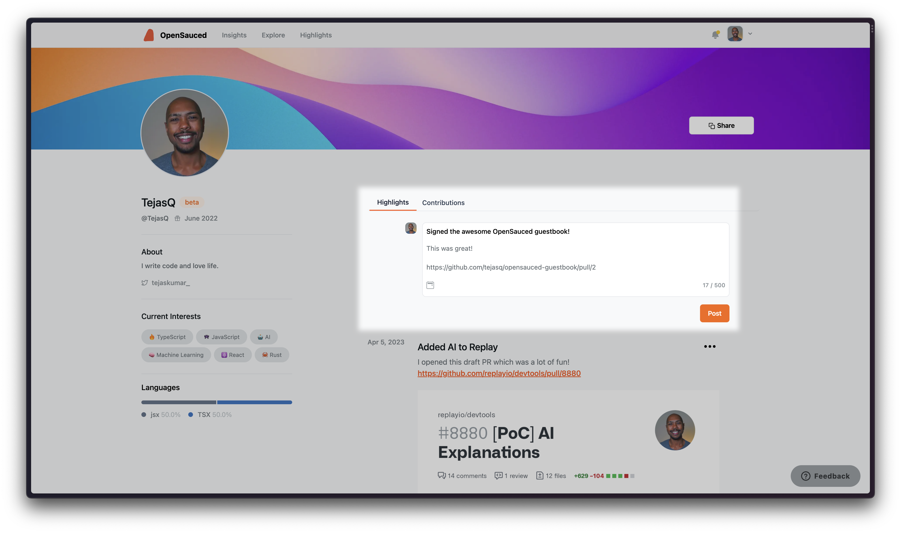

# La sauce secrète

Dans ce chapitre, nous partagerons quelques stratégies et astuces moins connues pour avoir un impact durable dans la communauté open source. Nous discuterons de la manière de se concentrer sur les problèmes ouverts, de gagner du terrain dans vos contributions et de développer votre CV open source à l'aide d'OpenSauced.

## Problèmes ouverts, plus que des relations publiques qui corrigent les fautes de frappe

Bien que la correction des fautes de frappe et l'amélioration de la documentation soient des contributions précieuses aux projets open source, il est essentiel de regarder au-delà de ces fruits à portée de main et de se concentrer sur la résolution des problèmes ouverts. La résolution des problèmes ouverts aide non seulement le projet à avancer, mais vous permet également de développer une compréhension plus approfondie de la base de code et de démontrer vos capacités de résolution de problèmes.

Voici quelques conseils pour trouver et résoudre les problèmes ouverts :

1. **Parcourez le suivi des problèmes** : la plupart des projets open source utilisent un suivi des problèmes pour gérer les bogues, les demandes de fonctionnalités et d'autres tâches. Parcourez l'outil de suivi des problèmes pour trouver des problèmes qui correspondent à vos intérêts et à vos compétences.

2. **Recherchez les problèmes adaptés aux débutants** : de nombreux projets utilisent des libellés tels que "bon premier problème" ou "demande d'aide" pour indiquer les problèmes qui conviennent aux nouveaux arrivants. Commencez par ces problèmes pour renforcer votre confiance et acquérir de l'expérience avant de vous attaquer à des tâches plus complexes.

3. **Comprendre le problème** : avant de plonger dans un problème, assurez-vous de bien comprendre le problème et le résultat souhaité. Si vous n'êtes pas sûr de quoi que ce soit, posez des questions ou demandez des éclaircissements aux mainteneurs du projet ou à d'autres contributeurs.

4. **Communiquez vos intentions** : avant de commencer à travailler sur un problème, faites savoir aux responsables du projet et aux autres contributeurs que vous êtes intéressé à le résoudre. Cela peut aider à éviter les efforts en double et à garantir que tout le monde est sur la même longueur d'onde.

5. **Testez vos modifications** : une fois que vous avez résolu un problème, testez soigneusement vos modifications pour vous assurer qu'elles fonctionnent comme prévu et n'introduisent pas de nouveaux problèmes.

En vous concentrant sur les problèmes ouverts plutôt que sur la simple correction des fautes de frappe, vous aurez un impact plus significatif sur les projets auxquels vous contribuez et démontrerez votre engagement envers la communauté open source.

## Gagner du terrain dans les contributions

Au fur et à mesure que vous devenez plus expérimenté dans les contributions open source, vous voudrez peut-être augmenter votre impact sur les projets sur lesquels vous travaillez et obtenir la reconnaissance de vos efforts. Voici quelques stratégies pour gagner du terrain dans vos contributions :

1. **Devenez un contributeur régulier** : Contribuez régulièrement aux mêmes projets au fil du temps. Cela vous aidera à développer une compréhension plus approfondie de la base de code, à établir des relations avec d'autres contributeurs et à vous établir comme un membre précieux de la communauté.

2. **Relevez des tâches difficiles** : au fur et à mesure que vous gagnez en expérience, abordez des problèmes et des fonctionnalités plus complexes. Cela vous aidera non seulement à grandir en tant que développeur, mais également à démontrer votre capacité à gérer des tâches difficiles et à contribuer de manière significative au projet.

3. **Collaborez avec d'autres** : l'open source est une question de collaboration. Travaillez avec d'autres contributeurs pour résoudre les problèmes, développer des fonctionnalités et partager des connaissances. En collaborant efficacement, vous améliorerez non seulement le projet, mais vous créerez également un solide réseau de connexions au sein de la communauté open source.

4. **Partagez votre expertise** : partagez vos connaissances et vos idées en écrivant des articles de blog, en créant des didacticiels ou en faisant des présentations sur les projets sur lesquels vous travaillez. Cela aidera non seulement les autres à apprendre de vos expériences, mais vous établira également en tant que leader d'opinion dans la communauté open source.

5. **Encadrez les nouveaux contributeurs** : au fur et à mesure que vous gagnez en expérience dans les contributions open source, envisagez d'encadrer les nouveaux contributeurs qui commencent tout juste leur parcours open source. Cela peut vous aider à redonner à la communauté, à développer vos compétences en leadership et à vous bâtir une réputation positive.

## Développez votre CV Open Source

Construire un CV open source solide peut vous aider à présenter vos compétences, votre expérience et vos contributions aux employeurs potentiels, aux collaborateurs et à la communauté des développeurs au sens large. OpenSauced est un excellent outil pour suivre vos contributions open source et développer votre CV open source. Voyons comment vous pouvez utiliser OpenSauced pour soutenir votre parcours open source.

1. **Inscrivez-vous à un compte OpenSauced** : si vous n'avez pas encore créé de compte, visitez [opensauced.pizza](https://opensauced.pizza/) et créez un compte en utilisant vos informations d'identification GitHub.

2. **Visitez votre page de profil public** : Après votre inscription, une page de profil public sera créée pour vous. Cette page affichera les informations de votre profil GitHub et une liste de vos contributions open source. Vous pouvez y accéder en cliquant sur votre nom d'utilisateur dans le coin supérieur droit de la page.

    

3. **Construisez votre CV Open Source** : À partir d'ici, vous pourrez ajouter des points forts aux demandes d'extraction et aux problèmes auxquels vous avez contribué. Vous pouvez également ajouter une description et des liens vers votre CV open source. Celles-ci seront regroupées en une seule page que vous pourrez partager avec d'autres, ainsi qu'un résumé de vos contributions qui sera affiché sur votre page de profil public.

Présentons notre contribution au livre d'or du chapitre précédent ! Dans votre profil, vous verrez une section "Faits saillants" avec une saisie de texte. Lorsque vous cliquez dessus, vous pourrez ajouter un titre, quelques réflexions et un lien vers votre PR. Cela sera affiché sur votre page de profil public. Ajoutons un point culminant pour notre contribution au livre d'or.

## Mettez efficacement en valeur vos contributions

Informations importantes à inclure lorsque vous mettez en avant vos contributions :

- Nouveau matériel que vous avez créé ;
- Détails du projet (outils, bibliothèques, taille et complexité);
- Le type de vos contributions : correction de bug, fonctionnalité, performance, documentation, etc.
- Les détails de votre contribution incluant les améliorations et impacts apportés sur le projet et sur la communauté ;
- Détails sur la collaboration et le travail d'équipe. 

### Formatage de votre Highlight

Pour être plus efficace dans la mise en valeur de vos contributions, nous vous recommandons d'utiliser le format suivant :

- **Description** : Lorsque vous mettez en avant votre contribution, nous vous recommandons de mentionner l'impact qu'elle a eu sur l'ensemble du projet. Cela serait utile pour mettre en évidence vos qualifications pour les postes, surtout si vous avez des lacunes en matière d'emploi. Envisagez d'utiliser le modèle suivant pour vous aider à transformer ce point culminant en une histoire :
  - Verbe succès + nom + métrique + résultat.
  - Exemple : pendant que j'examinais certaines demandes d'extraction pour le GirlScript Summer of Code de cette année, j'ai remarqué que la plupart d'entre elles ne fusionnaient pas malgré mon approbation et celle du propriétaire. J'ai donc **créé une action GitHub où les demandes d'extraction fusionnent automatiquement une fois qu'elles ont passé les étapes de déploiement (verbe successif + nom)**, ce qui **a augmenté les taux de productivité de 80% (métrique + résultat).**
- **Ajouter un dépôt** : Indiquez le nom complet du dépôt auquel vous apportez des contributions.
- **Lien** : Collez l'URL de votre pull request, de votre problème ou de votre article de blog.

**Partagez-le !** : Une fois que vous avez constitué un portefeuille de contributions open source, vous pouvez partager votre CV OpenSauced avec d'autres en cliquant sur le bouton de partage dans l'en-tête de votre page de profil. Cela peut être particulièrement utile lorsque vous postulez à des emplois, que vous travaillez en réseau avec d'autres développeurs ou que vous faites la promotion de votre travail dans la communauté open source.

En tirant parti d'OpenSauced pour suivre vos contributions open source et développer votre CV, vous serez mieux équipé pour mettre en valeur vos compétences, votre expérience et votre impact dans la communauté open source.

En conclusion, démarrer avec des contributions open source et avoir un impact durable sur les projets sur lesquels vous travaillez nécessite une combinaison de compétences techniques, de collaboration et de persévérance. En vous concentrant sur les problèmes ouverts, en gagnant du terrain dans vos contributions et en tirant parti d'outils comme OpenSauced, vous serez sur la bonne voie pour un voyage open source réussi et épanouissant.

[Section finale ->](07-différents-types-de-contributions.md)

<a href= "https://github.com/open-sauced/intro/edit/main/translations/fr/07-la-sauce-secrète.md">
  ✏️ Éditer cette page
</a>